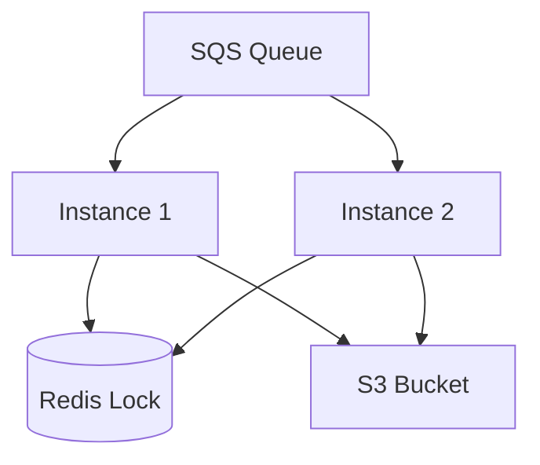

# Documentação do Projeto DATA_READING-Python

## Visão Geral do Projeto

Este projeto consiste em um serviço distribuído que:

- Consome mensagens de uma fila SQS da AWS  
- Processa PDFs contidos nas mensagens convertendo-os para CSV  
- Armazena os resultados em um bucket S3  
- Opera com múltiplas instâncias para balanceamento de carga  

## Diagrama de Arquitetura



---

## Pré-requisitos para Desenvolvimento no Windows

- Docker Desktop instalado e rodando  
- Git Bash instalado  
- Conta AWS com permissões para SQS e S3  
- Python 3.11+ (opcional para testes locais)  

---

## Configuração Inicial

Clone o repositório:

```bash
git clone <URL_DO_REPOSITORIO>
cd DATA_READING-Python
```

Crie o arquivo de ambiente:

```bash
cp .env.sample .env
```

Edite o `.env` com suas credenciais AWS:

```bash
notepad .env
```

---

## Estrutura de Arquivos

```
.
├── .env.sample          # Modelo de variáveis de ambiente
├── docker-compose.yml   # Definição dos serviços
├── Dockerfile           # Configuração do container
├── requirements.txt     # Dependências Python
└── src/
    ├── main.py          # Ponto de entrada
    ├── config.py        # Gerenciamento de configurações
    ├── sqs_handler.py   # Consumo da fila SQS
    ├── pdf_processor.py # Lógica de conversão PDF-CSV
    └── s3_uploader.py   # Upload para S3
```

---

## Comandos Básicos

**Iniciar os containers**

```bash
docker-compose up -d --build
```

**Parar os containers**

```bash
docker-compose down
```

**Ver logs**

```bash
docker-compose logs -f
```

**Escalar instâncias**

```bash
docker-compose up -d --scale pdf-processor=2
```

---

## Fluxo de Desenvolvimento

### Modificar o código:

Edite os arquivos na pasta `src` usando seu editor preferido.  
As alterações são refletidas automaticamente nos containers.

### Testar mudanças:

Para testes locais, modifique o `pdf_processor.py` para usar arquivos locais:

```python
def process_pdf_from_url(self, pdf_url):
    # Para desenvolvimento, substitua por leitura de arquivo local
    with open('test.pdf', 'rb') as f:
        return self._convert_pdf_to_csv(f)
```

### Reconstruir containers quando necessário:

```bash
docker-compose up -d --build
```

---

## Configurações Importantes

### Variáveis de Ambiente (`.env`)

| Variável                | Descrição                         | Exemplo                          |
|-------------------------|-----------------------------------|----------------------------------|
| AWS_ACCESS_KEY_ID       | Chave de acesso AWS               | AKIAxxxxxxxxxxxxxxxx             |
| AWS_SECRET_ACCESS_KEY   | Chave secreta AWS                 | xxxxxxxxxxxxxxxxxxxxxxxxxxxxxxxx |
| AWS_REGION              | Região AWS                        | us-east-1                        |
| SQS_QUEUE_URL           | URL da fila SQS                   | https://sqs...                   |
| S3_BUCKET_NAME          | Nome do bucket S3 de destino      | meu-bucket-processado            |

---

## Dicas para Desenvolvimento no Windows

### Git Bash como terminal padrão:

- Configure o Git Bash como terminal integrado no VS Code  
- Isso garante compatibilidade com os comandos Linux  

### Problemas com permissões:

```bash
# Caso tenha problemas com permissões de arquivo
git config --global core.autocrlf false
```

### Testando localmente sem AWS:

Você pode mockar os serviços AWS para desenvolvimento:

```python
# Em config.py
class MockSQS:
    def receive_message(self, **kwargs):
        return {"Messages": [{"Body": json.dumps({"pdf_url": "test.pdf"})}]}

# Substitua a criação do cliente boto3 por esta classe mock
```

---

## Monitoramento

Cada instância gera logs identificados pelo `INSTANCE_ID`:

```log
pdf-processor-1  | [Instance 1] Processing message: abc123...
pdf-processor-2  | [Instance 2] Processing message: def456...
```

---

## Solução de Problemas Comuns

### Erros de conexão com AWS:

- Verifique as credenciais no `.env`  
- Confira a região AWS  

### Problemas com o Redis:

```bash
# Teste a conexão com o Redis
docker exec -it pdf-to-csv-processor-redis-1 redis-cli ping
```

### Mensagens não sendo processadas:

- Verifique o `VisibilityTimeout` na fila SQS  
- Confira se há mensagens na fila:

```bash
aws sqs get-queue-attributes --queue-url <SQS_QUEUE_URL> --attribute-names ApproximateNumberOfMessages
```

---

## Boas Práticas

- **Nunca comitar credenciais:**  
  Mantenha o `.env` no `.gitignore`  

- **Testes locais:**  
  Crie uma pasta `test_data` com PDFs de exemplo  

- **Versionamento:**

```bash
git add .
git commit -m "Descrição das alterações"
git push origin main
```

---

## Próximos Passos

- Implementar tratamento de erros mais robusto  
- Adicionar métricas e monitoramento  
- Configurar CI/CD para deploy automático  

---

> Esta documentação está disponível no arquivo `README.md` do projeto para referência futura.
